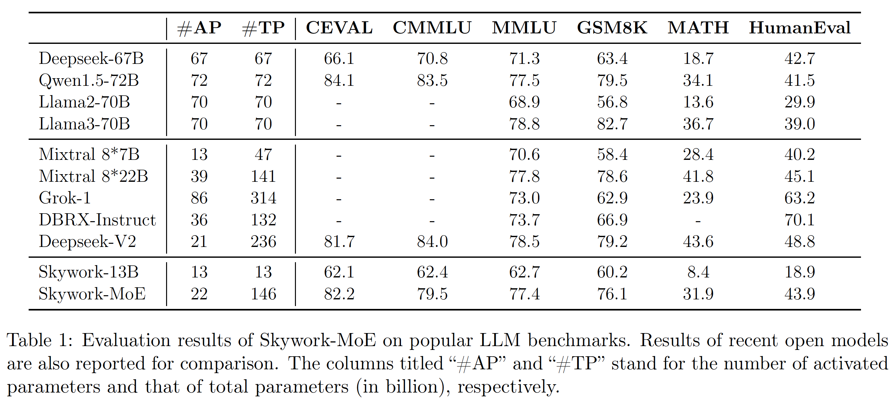

**English** | [简体中文](README_zh.md)

<!-- <div align="center">
<h1>
  ✨Skywork
</h1>
</div> -->
<div align="center"></div>

<p align="center">
🤗 <a href="https://huggingface.co/Skywork" target="_blank">Hugging Face</a> • 🤖 <a href="https://modelscope.cn/organization/Skywork" target="_blank">ModelScope</a> • 👾 <a href="https://wisemodel.cn/organization/Skywork" target="_blank">Wisemodel</a> • 💬 <a href="https://github.com/SkyworkAI/Skywork/blob/main/misc/wechat.png?raw=true" target="_blank">WeChat</a>• 📜<a href="https://github.com/SkyworkAI/Skywork-MoE/blob/main/skywork-moe-tech-report.pdf" target="_blank">Tech Report</a>
</p>

<div align="center">

[](https://github.com/SkyworkAI/Skywork-MoE/stargazers)
[](https://github.com/SkyworkAI/Skywork-MoE/fork)
</div>

<div align="center">

</div>


# Project Introduction

Skywork-MoE is a high-performance mixture-of-experts (MoE) model with 146 billion parameters, 16 experts, and 22 billion activated parameters. This model is initialized from the pre-existing dense checkpoints of our Skywork-13B model.

We introduce two innovative techniques: Gating Logit Normalization, which enhances expert diversification, and Adaptive Auxiliary Loss Coefficients, which allow for layer-specific adjustment of auxiliary loss coefficients.

Skywork-MoE demonstrates comparable or superior performance to models with more parameters or more activated parameters, such as Grok-1, DBRX, Mistral 8*22, and Deepseek-V2.

# News and Updates
* 2024.6.3  We release the **Skywork-MoE-Base** model.

# Table of contents

- [☁️Download URL](#Download-URL)
- [👨‍💻Benchmark Results](#Benchmark-Results)
- [🏆Demonstration of Hugging Face Model Inference](#Demonstration-of-HuggingFace-Model-Inference)
- [📕Demonstration of vLLM Model Inference](#Demonstration-of-vLLM-Model-Inference)
- [⚠️Declaration and License Agreement](#Declaration-and-License-Agreement)
- [🤝Contact Us and Citation](#Contact-Us-and-Citation)


# Download URL

|         |                               HuggingFace Model                                |  ModelScope Model   |  Wisemodel Model  |
|:-------:|:------------------------------------------------------------------------------:|:-----------------------------:|:-----------------------------:|
| **Skywork-MoE-Base**     |     🤗 [Skywork-MoE-Base](https://huggingface.co/Skywork/Skywork-MoE-Base)     | 🤖[Skywork-MoE-Base](https://www.modelscope.cn/models/skywork/Skywork-MoE-base) | 👾[Skywork-MoE-Base](https://wisemodel.cn/models/Skywork/Skywork-MoE-base) |
| **Skywork-MoE-Base-FP8**  | 🤗 [Skywork-MoE-Base-FP8](https://huggingface.co/Skywork/Skywork-MoE-Base-FP8) | 🤖 | 👾 |
| **Skywork-MoE-Chat** |                               😊 [Coming Soon]()                               | 🤖 | 👾 |

# Benchmark Results

We evaluated Skywork-MoE-Base model on various popular benchmarks, including C-Eval, MMLU, CMMLU, GSM8K, MATH and HumanEval.


# Demonstration of Hugging Face Model Inference

## Base Model Inference

We can perform inference for the Skywork-MoE-Base (16x13B size) model using HuggingFace on 8xA100/A800 or higher GPU hardware configurations.

```python

from transformers import AutoModelForCausalLM, AutoTokenizer

model = AutoModelForCausalLM.from_pretrained("Skywork/Skywork-MoE-Base", trust_remote_code=True, device_map='auto')
tokenizer = AutoTokenizer.from_pretrained("Skywork/Skywork-MoE-Base", trust_remote_code=True)

inputs = tokenizer('陕西的省会是西安', return_tensors='pt').to(model.device)
response = model.generate(inputs.input_ids, max_length=128)
print(tokenizer.decode(response.cpu()[0], skip_special_tokens=True))
"""
陕西的省会是西安。
西安，古称长安、镐京，是陕西省会、副省级市、关中平原城市群核心城市、丝绸之路起点城市、“一带一路”核心区、中国西部地区重要的中心城市，国家重要的科研、教育、工业基地。
西安是中国四大古都之一，联合国科教文组织于1981年确定的“世界历史名城”，美媒评选的世界十大古都之一。地处关中平原中部，北濒渭河，南依秦岭，八水润长安。下辖11区2县并代管西
"""

inputs = tokenizer('陕西的省会是西安，甘肃的省会是兰州，河南的省会是郑州', return_tensors='pt').to(model.device)
response = model.generate(inputs.input_ids, max_length=128)
print(tokenizer.decode(response.cpu()[0], skip_special_tokens=True))
"""
陕西的省会是西安，甘肃的省会是兰州，河南的省会是郑州，湖北的省会是武汉，湖南的省会是长沙，安徽的省会是合肥，江西的省会是南昌，江苏的省会是南京，浙江的省会是杭州，福建的省会是福州，广东的省会是广州，广西的省会是南宁，四川的省会是成都，贵州的省会是贵阳，云南的省会是昆明，山西的省会是太原，山东的省会是济南，河北的省会是石家庄，辽宁的省会是沈阳，吉林的省会是长春，黑龙江的
"""

```

## Chat Model Inference

comming soon...


# Demonstration of vLLM Model Inference

## Quickstart with vLLM

We provide a method to quickly deploy the Skywork-MoE-Base model based on vllm.

Under fp8 precision you can run Skywork-MoE-Base with just only 8*4090.

You can get the source code in [`vllm`](https://github.com/SkyworkAI/vllm)

You can get the fp8 model in [`Skywork-MoE-Base-FP8`](https://huggingface.co/Skywork/Skywork-MoE-Base-FP8)

### Based on local environment

Since pytorch only supports 4090 using fp8 precision in the nightly version, you need to install the corresponding or newer version of pytorch.

``` shell
# for cuda12.1
pip3 install --pre torch pytorch-triton --index-url https://download.pytorch.org/whl/nightly/cu121
# for cuda12.4
pip3 install --pre torch pytorch-triton --index-url https://download.pytorch.org/whl/nightly/cu124
```

Some other dependencies also need to be installed:

```shell
MAX_JOBS=8 pip3 install git+https://github.com/facebookresearch/xformers.git # need to wait for a long time
pip3 install vllm-flash-attn --no-deps
```

Then clone the [`vllm`](https://github.com/SkyworkAI/vllm) provided by skywork:

``` shell
git clone https://github.com/SkyworkAI/vllm.git
cd vllm
```

Then compile and install vllm:

``` shell
pip3 install -r requirements-build.txt
pip3 install -r requirements-cuda.txt
MAX_JOBS=8 python3 setup.py install
```

### Base on docker

You can use the docker image provided by skywork to run vllm directly:

```shell
docker pull registry.cn-wulanchabu.aliyuncs.com/triple-mu/skywork-moe-vllm:v1
```

Then start the container and set the model path and working directory.

```shell
model_path="Skywork/Skywork-MoE-Base-FP8"
workspace=${PWD}

docker run \
    --runtime nvidia \
    --gpus all \
    -it \
    --rm \
    --shm-size=1t \
    --ulimit memlock=-1 \
    --privileged=true \
    --ulimit stack=67108864 \
    --ipc=host \
    -v ${model_path}:/Skywork-MoE-Base-FP8 \
    -v ${workspace}:/workspace \
    registry.cn-wulanchabu.aliyuncs.com/triple-mu/skywork-moe-vllm:v1
```

Now, you can run the Skywork MoE base model for fun!

### Text Completion

``` python
from vllm import LLM, SamplingParams

model_path = 'Skywork/Skywork-MoE-Base-FP8'
prompts = [
    "The president of the United States is",
    "The capital of France is",
]

sampling_params = SamplingParams(temperature=0.3, max_tokens=256)

llm = LLM(
    model=model_path,
    kv_cache_dtype='auto',
    tensor_parallel_size=8,
    gpu_memory_utilization=0.95, 
    enforce_eager=True,
    trust_remote_code=True,
)

outputs = llm.generate(prompts, sampling_params)

for output in outputs:
    prompt = output.prompt
    generated_text = output.outputs[0].text
    print(f"Prompt: {prompt!r}, Generated text: {generated_text!r}")
```


# Declaration and License Agreement


## Declaration

We hereby declare that the Skywork model should not be used for any activities that pose a threat to national or societal security or engage in unlawful actions. Additionally, we request users not to deploy the Skywork model for internet services without appropriate security reviews and records. We hope that all users will adhere to this principle to ensure that technological advancements occur in a regulated and lawful environment.

We have done our utmost to ensure the compliance of the data used during the model's training process. However, despite our extensive efforts, due to the complexity of the model and data, there may still be unpredictable risks and issues. Therefore, if any problems arise as a result of using the Skywork open-source model, including but not limited to data security issues, public opinion risks, or any risks and problems arising from the model being misled, abused, disseminated, or improperly utilized, we will not assume any responsibility.

## License Agreement

The community usage of Skywork model requires [Skywork Community License](https://github.com/SkyworkAI/Skywork-MoE/blob/main/Skywork%20Community%20License.pdf). The Skywork model supports commercial use. If you plan to use the Skywork model or its derivatives for commercial purposes, you must abide by terms and conditions within [Skywork Community License](https://github.com/SkyworkAI/Skywork-MoE/blob/main/Skywork%20Community%20License.pdf).

  

[《Skywork 模型社区许可协议》》]:https://github.com/SkyworkAI/Skywork-MoE/blob/main/Skywork%20模型社区许可协议.pdf


[skywork-opensource@kunlun-inc.com]: mailto:skywork-opensource@kunlun-inc.com

# Contact Us and Citation
If you find our work helpful, please feel free to cite our paper~
```
@misc{wei2024skywork,
      title={Skywork-MoE: A Deep Dive into Training Techniques for Mixture-of-Experts Language Models}, 
      author={Tianwen Wei, Bo Zhu, Liang Zhao, Cheng Cheng, Biye Li, Weiwei Lü, Peng Cheng, Jianhao Zhang, Xiaoyu Zhang, Liang Zeng, Xiaokun Wang, Yutuan Ma, Rui Hu, Shuicheng Yan, Han Fang, Yahui Zhou},
      year={2024},
      archivePrefix={arXiv},
      primaryClass={cs.CL}
}
```

