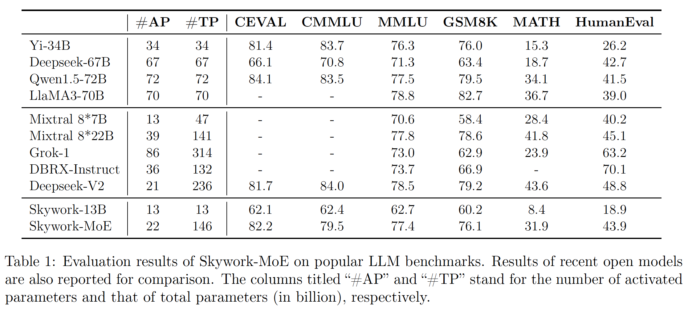

<!-- <div align="center">
<h1>
  ✨Skywork
</h1>
</div> -->
<div align="center"></div>

<p align="center">
🤗 <a href="https://huggingface.co/Skywork" target="_blank">Hugging Face</a> • 🤖 <a href="https://modelscope.cn/organization/Skywork" target="_blank">ModelScope</a> • 👾 <a href="https://wisemodel.cn/organization/Skywork" target="_blank">Wisemodel</a> • 💬 <a href="https://github.com/SkyworkAI/Skywork/blob/main/misc/wechat.png?raw=true" target="_blank">WeChat</a>• 📜<a href="http://arxiv.org/abs/2310.19341" target="_blank">Tech Report</a>
</p>

<div align="center">

[](https://github.com/SkyworkAI/Skywork-MoE/stargazers)
[](https://github.com/SkyworkAI/Skywork-MoE/fork)
</div>

<div align="center">

</div>


# 项目介绍

Skywork-MoE 是一个高性能的专家混合（MoE）模型，拥有1460亿参数、16个专家和220亿激活参数。该模型是基于我们现有的Skywork-13B模型的Dense检查点初始化的。

我们引入了两项创新技术：Gating Logit Normalization，增强专家多样性；Adaptive Auxiliary Loss Coefficients，允许对辅助损失系数进行层级调整。

Skywork-MoE 展示出与参数更多或激活参数更多的模型（如Grok-1、DBRX、Mistral 8*22 和 Deepseek-V2）相当或更优的性能。

# 新闻和更新
* 2024.6.3  我们发布了 **Skywork-MoE-Base** 模型。

# 目录

- [☁️下载链接](#下载链接)
- [👨‍💻基准测试结果](#基准测试结果)
- [🏆Hugging Face模型推理演示](#Hugging-Face模型推理演示)
- [📕vLLM模型推理演示](#vLLM模型推理演示)
- [⚠️声明和许可协议](#声明和许可协议)
- [🤝联系我们和引用](#联系我们和引用)


# 下载链接

|         |                                 HuggingFace 模型                                 |                                  ModelScope 模型                                  |                                Wisemodel 模型                                |
|:-------:|:------------------------------------------------------------------------------:|:-------------------------------------------------------------------------------:|:--------------------------------------------------------------------------:|
| **Skywork-MoE-Base**     |     🤗 [Skywork-MoE-Base](https://huggingface.co/Skywork/Skywork-MoE-Base)     | 🤖[Skywork-MoE-Base](https://www.modelscope.cn/models/skywork/Skywork-MoE-base) | 👾[Skywork-MoE-Base](https://wisemodel.cn/models/Skywork/Skywork-MoE-base) |
| **Skywork-MoE-Base-FP8**  | 🤗 [Skywork-MoE-Base-FP8](https://huggingface.co/Skywork/Skywork-MoE-Base-FP8) |                                       🤖                                        |                                     👾                                     |
| **Skywork-MoE-Chat** | 😊 [Coming Soon]() | 🤖 | 👾 |

# 基准测试结果

我们在各种热门基准测试（包括C-Eval、MMLU、CMMLU、GSM8K、MATH和HumanEval）上评估了Skywork-MoE-Base模型。


# Hugging Face模型推理演示

## 基础模型推理

我们可以使用HuggingFace在8xA100/A800或更高的GPU硬件配置上进行Skywork-MoE-Base（16x13B规模）模型的推理。

```python

from transformers import AutoModelForCausalLM, AutoTokenizer

model = AutoModelForCausalLM.from_pretrained("Skywork/Skywork-MoE-Base", trust_remote_code=True, device_map='auto')
tokenizer = AutoTokenizer.from_pretrained("Skywork/Skywork-MoE-Base", trust_remote_code=True)

inputs = tokenizer('陕西的省会是西安', return_tensors='pt').to(model.device)
response = model.generate(inputs.input_ids, max_length=128)
print(tokenizer.decode(response.cpu()[0], skip_special_tokens=True))
"""
陕西的省会是西安。
西安，古称长安、镐京，是陕西省会、副省级市、关中平原城市群核心城市、丝绸之路起点城市、“一带一路”核心区、中国西部地区重要的中心城市，国家重要的科研、教育、工业基地。
西安是中国四大古都之一，联合国科教文组织于1981年确定的“世界历史名城”，美媒评选的世界十大古都之一。地处关中平原中部，北濒渭河，南依秦岭，八水润长安。下辖11区2县并代管西
"""

inputs = tokenizer('陕西的省会是西安，甘肃的省会是兰州，河南的省会是郑州', return_tensors='pt').to(model.device)
response = model.generate(inputs.input_ids, max_length=128)
print(tokenizer.decode(response.cpu()[0], skip_special_tokens=True))
"""
陕西的省会是西安，甘肃的省会是兰州，河南的省会是郑州，湖北的省会是武汉，湖南的省会是长沙，安徽的省会是合肥，江西的省会是南昌，江苏的省会是南京，浙江的省会是杭州，福建的省会是福州，广东的省会是广州，广西的省会是南宁，四川的省会是成都，贵州的省会是贵阳，云南的省会是昆明，山西的省会是太原，山东的省会是济南，河北的省会是石家庄，辽宁的省会是沈阳，吉林的省会是长春，黑龙江的
"""

```


# vLLM模型推理演示

## 基于vLLM的快速启动

我们提供了一种基于vllm快速部署Skywork-MoE-Base模型的方法。

在fp8精度下，你只需8*4090即可运行Skywork-MoE-Base。

你可以在[`vllm`](https://github.com/SkyworkAI/vllm)中获取源代码。

你可以在[`Skywork-MoE-Base-FP8`](https://huggingface.co/Skywork/Skywork-MoE-Base-FP8)中获取fp8模型。

### 基于本地环境

由于pytorch仅在nightly版本中支持4090使用fp8精度，你需要安装相应或更新版本的pytorch。

``` shell
# for cuda12.1
pip3 install --pre torch pytorch-triton --index-url https://download.pytorch.org/whl/nightly/cu121
# for cuda12.4
pip3 install --pre torch pytorch-triton --index-url https://download.pytorch.org/whl/nightly/cu124
```

还需要安装其它一些依赖：

```shell
MAX_JOBS=8 pip3 install git+https://github.com/facebookresearch/xformers.git # 需要等待较长时间
pip3 install vllm-flash-attn --no-deps
```

然后克隆skywork提供的[`vllm`](https://github.com/SkyworkAI/vllm)：

``` shell
git clone https://github.com/SkyworkAI/vllm.git
cd vllm
```

然后编译并安装vllm：

``` shell
pip3 install -r requirements-build.txt
pip3 install -r requirements-cuda.txt
MAX_JOBS=8 python3 setup.py install
```

### 基于docker

你可以使用skywork提供的docker镜像直接运行基于vllm的推理：

```shell
docker pull registry.cn-wulanchabu.aliyuncs.com/triple-mu/skywork-moe-vllm:v1
```

然后启动容器并设置模型路径和工作目录。

```shell
model_path="Skywork/Skywork-MoE-Base-FP8"
workspace=${PWD}

docker run \
    --runtime nvidia \
    --gpus all \
    -it \
    --rm \
    --shm-size=1t \
    --ulimit memlock=-1 \
    --privileged=true \
    --ulimit stack=67108864 \
    --ipc=host \
    -v ${model_path}:/Skywork-MoE-Base-FP8 \
    -v ${workspace}:/workspace \
    registry.cn-wulanchabu.aliyuncs.com/triple-mu/skywork-moe-vllm:v1
```

现在，你可以运行 Skywork MoE 模型来体验一下！

### 文本补全

``` python
from vllm import LLM, SamplingParams

model_path = 'Skywork/Skywork-MoE-Base-FP8'
prompts = [
    "The president of the United States is",
    "The capital of France is",
]

sampling_params = SamplingParams(temperature=0.3, max_tokens=256)

llm = LLM(
    model=model_path,
    quantization='fp8',
    kv_cache_dtype='fp8',
    tensor_parallel_size=8,
    gpu_memory_utilization=0.95, 
    enforce_eager=True,
    trust_remote_code=True,
)

outputs = llm.generate(prompts, sampling_params)

for output in outputs:
    prompt = output.prompt
    generated_text = output.outputs[0].text
    print(f"Prompt: {prompt!r}, Generated text: {generated_text!r}")
```


# 声明和许可协议


## 声明

我们在此声明，Skywork模型不得用于任何威胁国家或社会安全的活动或参与非法行为。此外，我们要求用户在没有进行适当的安全审查和备案的情况下，不要将Skywork模型用于互联网服务。我们希望所有用户遵守这一原则，以确保技术进步在一个受监管和合法的环境中进行。

我们已尽最大努力确保在模型训练过程中使用的数据的合规性。然而，尽管我们付出了大量努力，由于模型和数据的复杂性，仍可能存在不可预测的风险和问题。因此，如果由于使用Skywork开源模型而引发的任何问题，包括但不限于数据安全问题、舆论风险或因模型被误导、滥用、传播或不当利用而产生的任何风险和问题，我们将不承担任何责任。

## 许可协议

Skywork模型的社区使用需要遵守 [Skywork社区许可](https://github.com/SkyworkAI/Skywork-MoE/blob/main/Skywork%20Community%20License.pdf)。Skywork模型支持商业使用。如果您计划将Skywork模型或其衍生品用于商业目的，您必须遵守 [Skywork社区许可](https://github.com/SkyworkAI/Skywork-MoE/blob/main/Skywork%20Community%20License.pdf)中的条款和条件。

  

[《Skywork 模型社区许可协议》]:https://github.com/SkyworkAI/Skywork-MoE/blob/main/Skywork%20模型社区许可协议.pdf


[skywork-opensource@kunlun-inc.com]: mailto:skywork-opensource@kunlun-inc.com

# 联系我们和引用
如果你觉得我们的工作有帮助，请随意引用我们的论文~
```
@misc{wei2024skywork,
      title={Skywork-MoE: A Deep Dive into Training Techniques for Mixture-of-Experts Language Models}, 
      author={Tianwen Wei, Bo Zhu, Liang Zhao, Cheng Cheng, Biye Li, Weiwei Lü, Peng Cheng, Jianhao Zhang, Xiaoyu Zhang, Liang Zeng, Xiaokun Wang, Yutuan Ma, Rui Hu, Shuicheng Yan, Han Fang, Yahui Zhou},
      year={2024},
      archivePrefix={arXiv},
      primaryClass={cs.CL}
}
```
